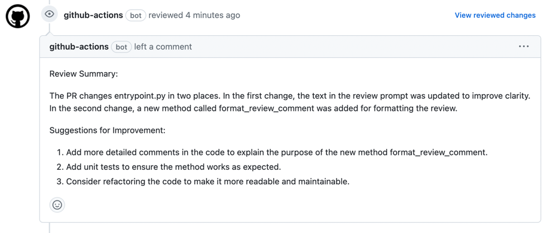

# Streamlining Your Pull Request Workflow with GPT-Powered Reviews
In this article, we explore how to use OpenAI's GPT to automate pull request reviews in your software development workflow.
Specifically, we focus on how to implement GPT-powered pull request reviews using GitHub Actions, a powerful tool for automating workflows in GitHub repositories.



## Introduction

Pull requests are an essential component of modern software development workflows.
They allow developers to review and provide feedback on proposed code changes before they are merged into the main codebase.
However, the review process can be time-consuming and error-prone, especially for large codebases or complex changes.
This is where OpenAI's GPT comes in.
By automating some of the code review process using GPT-powered pull request reviews, developers can save time and ensure code quality.
In this article, we will explore how to implement GPT-powered pull request reviews using GitHub Actions and provide an example of how it can be used in practice.

GitHub Actions is a powerful tool for automating workflows in your software development projects.
With GitHub Actions, you can build, test, and deploy your code with ease, all while keeping your workflow organized and streamlined.

To set up GPT-powered pull request reviews with GitHub Actions, you will need to create a workflow file in your project's repository.
This workflow file will define the steps to be executed when a pull request is opened or updated.

One important consideration when using GPT-powered pull request reviews is how to handle large changes in a pull request.
To address this issue, the GitHub Actions workflow will chunk the differences in the pull request into smaller segments for the GPT model to review. This ensures that the GPT model can handle large pull requests without running out of memory or taking too long to generate feedback.

Once you have set up the workflow file and configured the chunking strategy, you can start using GPT-powered pull request reviews to improve your code quality and streamline your workflow.

## Example usage of the GitHub Actions

To use the GPT-powered pull request review GitHub Actions workflow, you will need to create a YAML file in your repository's `.github/workflows directory`.
Here's an example YAML file that shows how to use the GPT-powered pull request review GitHub Actions workflow.

Where extra_prompt is set to "You are very familiar with python too.", as the project is written in python.
To be honest, I have no idea that the extra prompt affects the review comment, but it seems to be working.
We can optimize the extra prompt based on the technology stack of our project.

```yaml
# .github/workflows/gpt-code-review.yml
name: "Code Review by GPT"

on:
  pull_request:
    paths-ignore:
      - "*.md"
      - "LICENSE"

jobs:
  review:
    runs-on: ubuntu-latest
    permissions:
      contents: read
      pull-requests: write
    steps:
      - uses: actions/checkout@v3
      - name: "Get diff of the pull request"
        id: get_diff
        shell: bash
        env:
          DEFAULT_BRANCH: "${{ github.event.repository.default_branch }}"
          PULL_REQUEST_HEAD_REF: "${{ github.event.pull_request.head.ref }}"
        run: |-
          # Fetch the default branch
          git fetch origin "${{ env.DEFAULT_BRANCH }}"
          # Exclude png files from diff
          git diff "origin/${{ env.DEFAULT_BRANCH }}" ":(exclude)*.png" > "diff.txt"
          # Put multi-line string into an environment variable
          # shellcheck disable=SC2086
          {
            echo "pull_request_diff<<EOF";
            cat "diff.txt";
            echo 'EOF';
          } >> $GITHUB_OUTPUT
      - uses: yu-iskw/gpt-code-review-action@v0.1.0
        name: "Code Review by GPT"
        id: review
        with:
          openai_api_key: ${{ secrets.OPENAI_API_KEY }}
          github_token: ${{ secrets.GH_TOKEN }}
          github_repository: ${{ github.repository }}
          github_pull_request_number: ${{ github.event.pull_request.number }}
          git_commit_hash: ${{ github.event.pull_request.head.sha }}
          model: "text-davinci-003"
          temperature: "0.7"
          max_tokens: "512"
          top_p: "1"
          frequency_penalty: "0.0"
          presence_penalty: "0.0"
          pull_request_diff: |-
            ${{ steps.get_diff.outputs.pull_request_diff }}
          extra_prompt: |-
            You are very familiar with python too.
          log_level: "DEBUG"

```

## Inputs for the GitHub Actions
To enable GPT-powered pull request reviews in your GitHub Actions workflow, you will need to configure several inputs. These inputs include both API keys and parameters for the GPT model.

Here are the inputs required for the GitHub Actions workflow:

- `openai_api_key`: The OpenAI API key to access the OpenAI API. You can obtain an API key by signing up for an OpenAI account and creating an API key in the dashboard.
- `github_token`: The GitHub token to access the GitHub API. You can generate a GitHub token in your GitHub account settings, and you will need to provide the repo and pull_request scopes.
- `github_repository`: The GitHub repository to post a review comment. This input should be set to the repository where the pull request was opened or updated.
- `github_pull_request_number`: The GitHub pull request number to post a review comment. This input should be set to the number of the pull request that triggered the workflow.
- `git_commit_hash`: The git commit hash to post a review comment. This input should be set to the commit hash of the pull request that triggered the workflow.
- `pull_request_diff`: The diff of the pull request to generate a review comment. This input should be set to the diff of the pull request that triggered the workflow. The workflow will chunk the diff into smaller segments for the GPT model to review.
- `extra_prompt`: The extra prompt to generate a review comment. This input is optional and can be used to provide additional context for the GPT model.
- `model`: This parameter determines which pre-trained model to use for generating the review comment. OpenAI offers several models, each of which is fine-tuned for different use cases. The available models include Davinci, Curie, Babbage, Ada, and more. The Davinci model is the largest and most powerful, while the others are smaller and faster. Depending on the size and complexity of your codebase, you may need to experiment with different models to find one that works best for your needs.
- `temperature`: This parameter controls the randomness of the generated text. A higher temperature leads to more creative and diverse responses, while a lower temperature leads to more predictable and conservative responses. The default value is 0.5, which is a good starting point.
- `top_p`: This parameter controls the diversity of the generated text by restricting the generated text to the top p most likely tokens. A higher value of top_p leads to more diverse responses, while a lower value leads to more predictable and conservative responses. The default value is 0.9.
- `max_tokens`: This parameter controls the maximum length of the generated text. If the generated text exceeds this limit, it will be truncated. The default value is 2048 tokens.
- `frequency_penalty`: This parameter encourages the model to avoid repeating itself by penalizing the frequency of previously generated tokens. A higher value of frequency_penalty leads to more diverse responses, while a lower value leads to more repetitive responses. The default value is 0.
- `presence_penalty`: This parameter encourages the model to avoid generating text that contradicts the input. It penalizes the presence of words that appear in the input but not in the generated text. A higher value of presence_penalty leads to more conservative responses, while a lower value leads to more creative responses. The default value is 0.
- `log_level`: The log level to print logs. This input is optional and can be used to control the verbosity of the logs generated by the workflow.

By configuring these inputs correctly, you can ensure that your GPT-powered pull request reviews work smoothly and provide valuable feedback to developers.

## Generating Prompts for OpenAI's GPT

The prompts used to generate review comments by OpenAI's GPT vary based on the size of the pull request.
For smaller pull requests that can be processed in a single request, the following prompt is used:

```text
This is a pull request or a part of a pull request if the pull request is too large.
Please assume you review this PR as a great software engineer and a great security engineer.
Can you tell me the issues with differences in a pull request and provide suggestions to improve it?
You can provide a summary of the review and comments about issues by file, if any important issues are found.

{extra_prompt}

The PR diff starts from the line below.
{diff}
```

Here, the diff is the actual difference in the pull request, and the extra_prompt can be any additional context that the user wants to provide.

For larger pull requests, the changes are chunked into smaller pieces, and each chunk is reviewed separately by OpenAI's GPT.
The resulting review comments are summarized with the following prompt:

```text
This is a pull request of a set of reviews of a pull request.
Those are generated by OpenAI's GPT.
Can you summarized them?
It would be good to focus on highlighting issues and providing suggestions to improve the pull request.

---
{chunked_reviews}
```

Here, chunked_reviews is the set of review comments generated by OpenAI's GPT for each chunk of the pull request.
The final summarized comment can be used as feedback for the pull request.

## Conclusion

In this article, we have shown how to implement a GitHub Action that uses OpenAI's GPT to review a pull request.
We have discussed the different inputs needed for the GitHub Action, as well as the various parameters that can be tuned to generate better review comments. We have also provided an example YAML file to help users get started quickly.

We have also discussed how we generate prompts for the GPT model, both for small and large pull requests.
By breaking down large pull requests into smaller chunks and generating reviews for each chunk, we can avoid hitting the limits of the OpenAI API.

Overall, this GitHub Action provides a simple yet powerful way to generate automated code reviews.
It can save developers a lot of time and effort, and help catch potential issues and improvements early in the development process.
We hope that this article has been helpful in explaining how to use OpenAI's GPT to review pull requests, and that it inspires further experimentation and innovation in this area.
